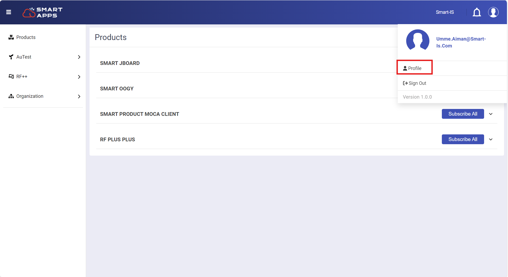
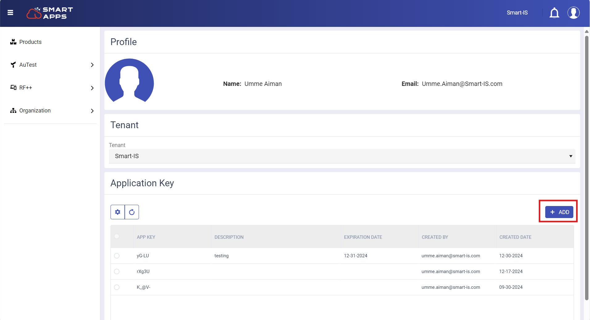
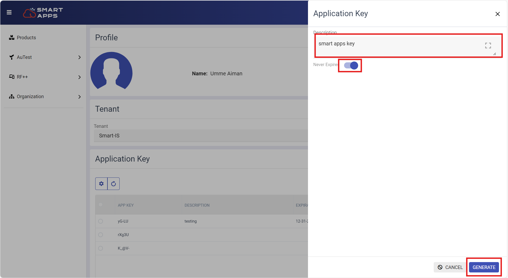
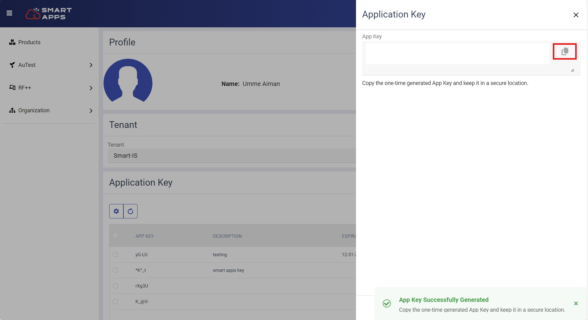

# Smart Apps Features
  

## Key Generation

The Application Key streamlines access management for subscribed Smart Products by ensuring a secure and efficient connection across various client applications, including AuTest, RF++, and Moca Client. This key plays a critical role in maintaining robust security and seamless integration during the connection process

Following are the steps for key generation:
- After logging into the website, the first step is to navigate to your profile section.

   

- The next step is to click on the "Add" button to generate your unique key.

   

- Enter a description for your key. To ensure your key never expires, toggle the slider to the right. If you prefer the key to expire, slide it to the left and specify the expiration date.

   

- The key will be successfully generated. You can now copy the key and use it as needed.

   

## Product Maintenance

### RF++
Smart RF Plus is a comprehensive RF solution designed to enhance JDA/Blue Yonder (BY) WMS implementations. This application is tailored to optimize the functionality of physical devices used on the warehouse floor, facilitating seamless execution of various warehouse operations. Developed by Smart IS, the Smart RF Plus app integrates smoothly with the standard JDA/BY solution, offering support for both delivered and custom RF screens without requiring additional work.

 

Click [here](https://oracularis.github.io/smartrf/#/./readme) to read more about our product. 

### AuTest
The Smart AuTest solution is designed to streamline and automate the testing of WMS (Warehouse Management System) use cases for BY WMS users, eliminating the need for manual intervention.  

 

Click [here](https://oracularis.github.io/autest/#/./readme) to read more about our product. 

## Subscription Management
Smart Apps offers a user-friendly interface for managing subscriptions. Users can easily track their active subscriptions, view renewal dates, and make changes as needed, all from a single dashboard. 

## User Maintenance 

### User Level Access 
Smart Apps offers controlled access levels for users within organizations to ensure secure and efficient data management

- **Read Only Access:**  Some users have read-only access, allowing them to view data without the ability to modify it. This level is typically granted to users who only need to monitor or review information.

- **Read and Write Access:** Some users have both read and write permissions, allowing them to view and update data. This access level is granted to users who require full functionality within the organization’s subscribed products.

