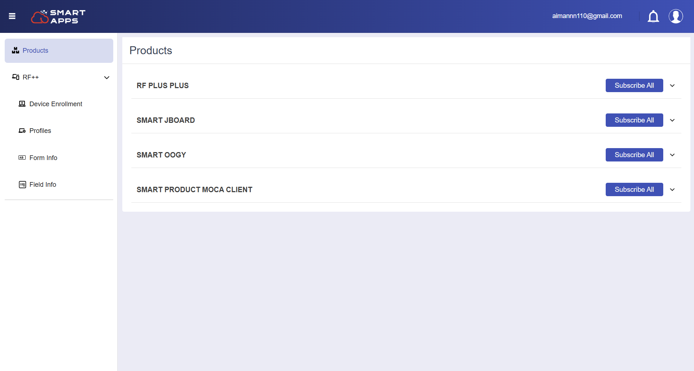
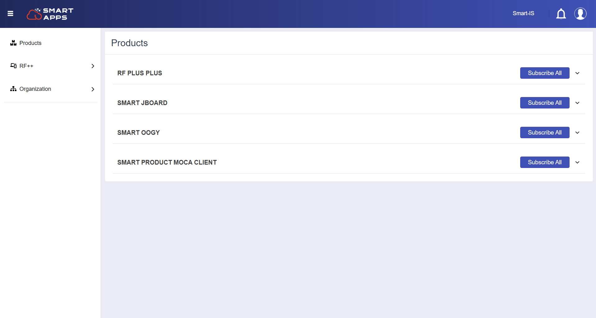

## Get started with Smart Apps

## Account Creation 

To begin using Smart Apps, users need to create an account. There are two simple options for account creation: 

### Login with Personal Email 
Users can sign up or log in using their personal email address to access the platform and manage subscriptions.  

- Start by navigating to the Smart Apps website to access the login page. 

- Input your personal email address and password in the provided field, ensuring that it is a valid and accessible email. 

- Finally, you will be logged in. 

### Login with Organizational Email

Alternatively, users can log in using the email provided by the organization they are affiliated with. This is particularly useful for employees who want to access apps related to their company's services or business needs. 

- Begin by navigating to the Smart Apps website to access the login page. 
  

- Input your organization-provided email address with the correct domain to ensure it is recognized by the system. 

- Type in the password associated with your organization account, then proceed to log in. 

- Finally, you will be logged in. 
   

